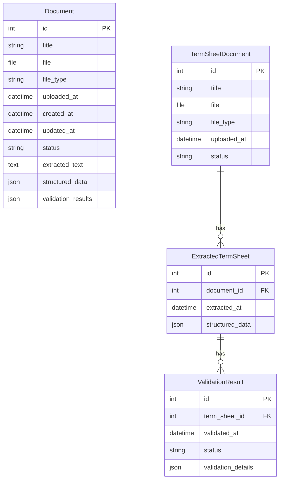
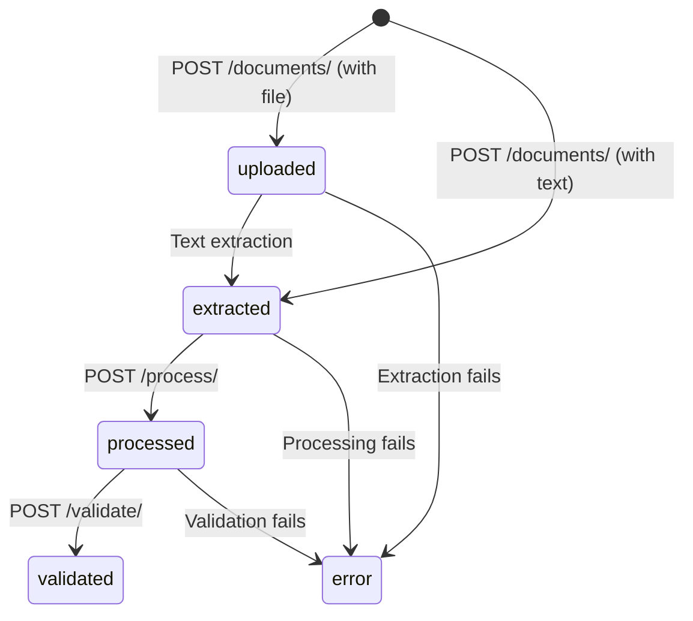
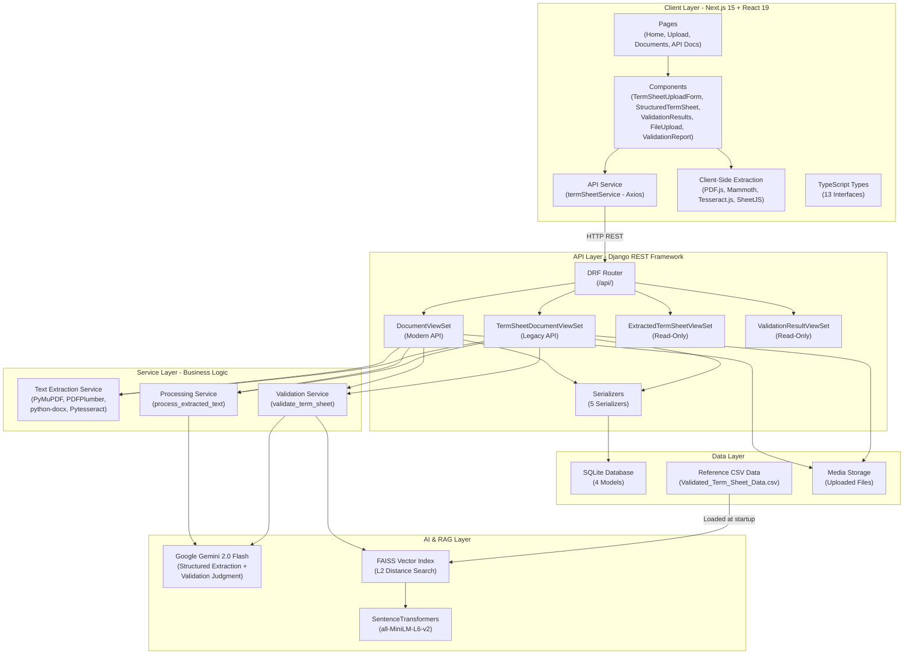
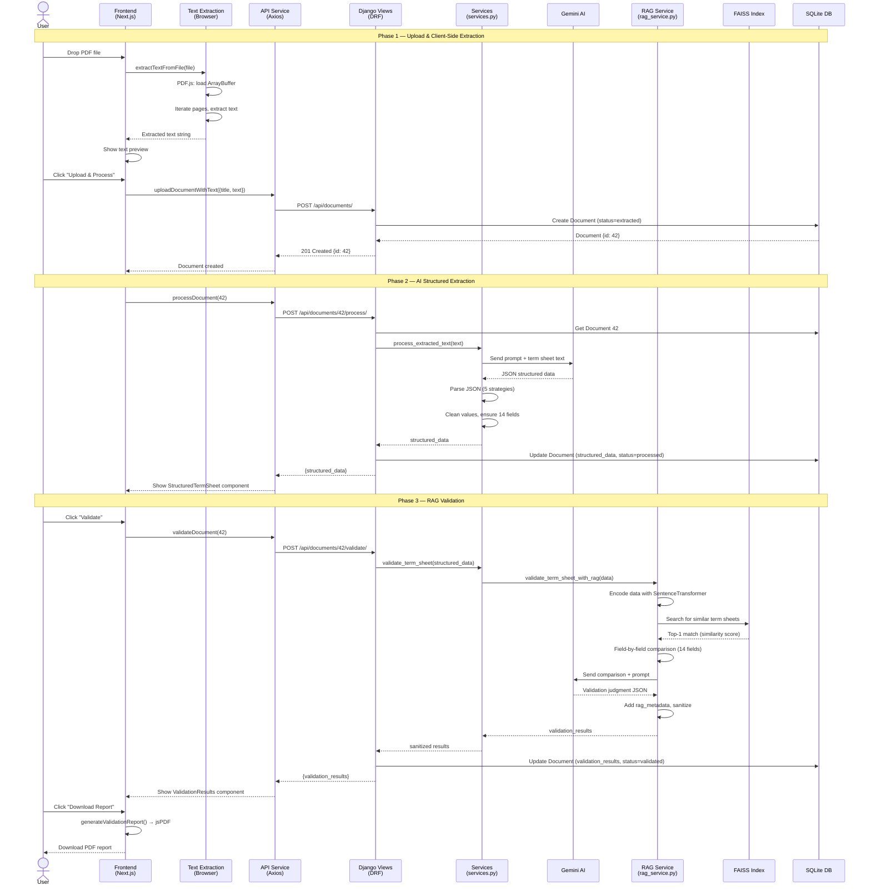
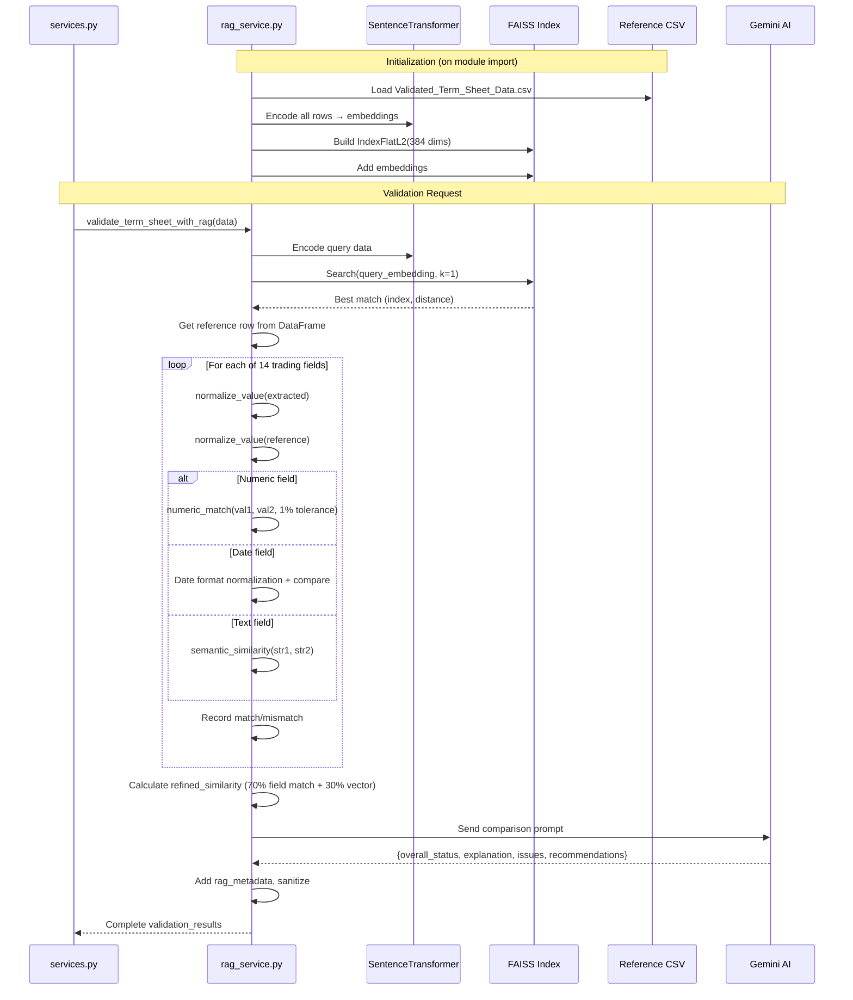

# NeuroLex: Term Sheet Analyzer — Technical Documentation

> **Version:** 1.0 · **Last Updated:** February 23, 2026
> A comprehensive "Zero-to-Hero" guide for new developers joining the project.

---

## Table of Contents

1. [Project Overview](#1-project-overview)
2. [Architecture Overview](#2-architecture-overview)
3. [Component-Level Breakdown](#3-component-level-breakdown)
4. [Functioning & Logic Flow](#4-functioning--logic-flow)
5. [API & Data Models](#5-api--data-models)
6. [Architecture Diagram (Mermaid.js)](#6-architecture-diagram-mermaidjs)
7. [Sequence Diagram (Mermaid.js)](#7-sequence-diagram-mermaidjs)
8. [Environment & Setup](#8-environment--setup)
9. [Error Handling Strategy](#9-error-handling-strategy)
10. [Key Design Decisions](#10-key-design-decisions)

---

## 1. Project Overview

### Purpose

**NeuroLex** is a full-stack AI-powered application that automates the analysis and validation of **financial trading term sheets**. It extracts structured data from unstructured documents (PDFs, DOCX, images, text) using AI, then validates the extracted data against a reference database using Retrieval-Augmented Generation (RAG).

### Core Value Proposition

| Capability | Description |
|---|---|
| **Multi-format Ingestion** | Upload term sheets as PDF, DOCX, images (OCR), or plain text |
| **AI-Powered Extraction** | Gemini AI converts unstructured text → structured JSON with 14 trading fields |
| **RAG Validation** | FAISS vector store + SentenceTransformers find similar reference sheets; Gemini validates against them |
| **Client-Side Extraction** | PDF.js, Mammoth, Tesseract.js extract text in the browser for performance |
| **PDF Reporting** | Generate downloadable validation reports as professional PDFs |

### Tech Stack

| Layer | Technology | Version |
|-------|-----------|---------|
| **Frontend Framework** | Next.js (App Router) | 15.2.4 |
| **UI Library** | React | 19.0 |
| **Language** | TypeScript | 5.x |
| **Styling** | TailwindCSS | 4.x |
| **HTTP Client** | Axios | 1.8.4 |
| **PDF Extraction (Client)** | pdfjs-dist | 3.11.174 |
| **DOCX Extraction (Client)** | Mammoth | 1.9.0 |
| **OCR (Client)** | Tesseract.js | 6.0.0 |
| **Excel Parsing** | xlsx (SheetJS) | 0.18.5 |
| **PDF Report Generation** | jsPDF + jspdf-autotable | 3.0.1 / 5.0.2 |
| **Icons** | react-icons (Feather) | 5.5.0 |
| **Backend Framework** | Django + DRF | 5.1.7 / 3.16.0 |
| **AI Model** | Google Gemini (`gemini-2.0-flash`) | via `google-generativeai` 0.8.4 |
| **Vector Search** | FAISS (CPU) | 1.10.0 |
| **Embeddings** | SentenceTransformers (`all-MiniLM-L6-v2`) | 4.0.1 |
| **PDF Extraction (Server)** | PyMuPDF + PDFPlumber + Pytesseract | Various |
| **DOCX Extraction (Server)** | python-docx | 1.1.2 |
| **Database** | SQLite | Built-in |
| **CORS** | django-cors-headers | 4.7.0 |

---

## 2. Architecture Overview

### Structural Pattern

NeuroLex follows a **Layered Client-Server Architecture** with clear separation of concerns:

```
┌──────────────────────────────────────────────────────┐
│                   FRONTEND (Next.js)                 │
│  ┌──────────┐  ┌──────────┐  ┌────────────────────┐ │
│  │  Pages    │  │Components│  │  Services/Utils    │ │
│  │ (Routes)  │──│ (UI)     │──│ (API, Extraction)  │ │
│  └──────────┘  └──────────┘  └────────────────────┘ │
└──────────────────────┬───────────────────────────────┘
                       │ HTTP (REST API via Axios)
┌──────────────────────▼───────────────────────────────┐
│                   BACKEND (Django + DRF)             │
│  ┌──────────┐  ┌──────────┐  ┌────────────────────┐ │
│  │  Views   │  │ Services │  │   RAG Service      │ │
│  │(ViewSets)│──│(Extraction│──│(FAISS + Gemini AI) │ │
│  └──────────┘  │ + Gemini)│  └────────────────────┘ │
│                └──────────┘                          │
│  ┌──────────┐  ┌──────────────┐  ┌───────────────┐  │
│  │  Models  │  │  Serializers  │  │  CSV Data     │  │
│  │ (ORM)   │──│  (DRF)        │  │  (Reference)  │  │
│  └──────┬───┘  └──────────────┘  └───────────────┘  │
└─────────┼────────────────────────────────────────────┘
          │
    ┌─────▼─────┐
    │  SQLite   │
    │  Database │
    └───────────┘
```

### Key Architectural Characteristics

- **Dual Text Extraction**: Text can be extracted client-side (browser) OR server-side. The frontend preferentially extracts text in the browser and sends the raw text to the backend, offloading heavy computation from the server.
- **Stateful Processing Pipeline**: Each document moves through states: `uploaded` → `extracted` → `processed` → `validated`.
- **FAISS-backed RAG**: A vector store built from CSV reference data enables semantic search to find similar term sheets for validation comparison.
- **Two API Versions**: A legacy `TermSheetDocumentViewSet` (file-only upload) and a modern `DocumentViewSet` (supports both file upload and pre-extracted text) coexist in the codebase.

---

## 3. Component-Level Breakdown

### 3.1 Backend (`backend/`)

#### 3.1.1 `termsheet_processor/` — Django Project Configuration

| File | Responsibility |
|------|---------------|
| `settings.py` | Django settings: SQLite DB, CORS (allow all origins), DRF config, Gemini API key, media file paths |
| `urls.py` | Root URL configuration: mounts `api/` routes and Django admin at `admin/` |
| `wsgi.py` / `asgi.py` | WSGI/ASGI entry points for deployment |

#### 3.1.2 `api/` — Core Application Module

##### `models.py` — Data Layer (4 Models)

| Model | Purpose | Key Fields |
|-------|---------|------------|
| `Document` | **Primary unified model** for the modern workflow | `title`, `file`, `file_type`, `status`, `extracted_text`, `structured_data` (JSON), `validation_results` (JSON) |
| `TermSheetDocument` | **Legacy model** for file-only uploads | `title`, `file`, `file_type`, `status` |
| `ExtractedTermSheet` | Stores extracted structured data (linked to `TermSheetDocument`) | `document` (FK), `structured_data` (JSON) |
| `ValidationResult` | Stores validation outcomes (linked to `ExtractedTermSheet`) | `term_sheet` (FK), `status`, `validation_details` (JSON) |

**Important Design Note**: The `Document` model is self-contained (stores text, structured data, AND validation results in one row), while the `TermSheetDocument` → `ExtractedTermSheet` → `ValidationResult` chain is a normalized legacy pattern.

##### `views.py` — API Endpoints (4 ViewSets)

| ViewSet | Base URL | Custom Actions | Description |
|---------|----------|---------------|-------------|
| `DocumentViewSet` | `/api/documents/` | `process`, `validate` | Modern API: accepts file OR pre-extracted text |
| `TermSheetDocumentViewSet` | `/api/term-sheets/` | `process`, `validate` | Legacy API: file-only uploads |
| `ExtractedTermSheetViewSet` | `/api/extracted-data/` | None (read-only) | Browse extracted data |
| `ValidationResultViewSet` | `/api/validations/` | None (read-only) | Browse validation results |

##### `services.py` — Business Logic Layer

| Function | Responsibility |
|----------|---------------|
| `extract_text_from_file(uploaded_file)` | Routes to appropriate extractor based on file extension |
| `extract_text_from_pdf(pdf_file)` | Multi-strategy PDF extraction: PyMuPDF → PDFPlumber → OCR fallback |
| `extract_pdf_with_ocr(pdf_file)` | Converts PDF pages to images, applies Pytesseract OCR |
| `extract_text_from_docx(docx_file)` | Extracts text from paragraphs and tables using python-docx |
| `process_extracted_text(text)` | **Core AI function**: sends text to Gemini with a structured prompt, parses JSON response with 5 fallback strategies, extracts 14 trading fields |
| `validate_term_sheet(structured_data)` | Delegates to RAG service, sanitizes NaN/Infinity, ensures JSON serialization |

##### `rag_service.py` — RAG Validation Engine (891 lines)

| Function | Responsibility |
|----------|---------------|
| `initialize_vector_store()` | Loads `Validated_Term_Sheet_Data.csv`, creates embeddings with `all-MiniLM-L6-v2`, builds FAISS L2 index. Runs on module import. |
| `search_similar_term_sheets(structured_data, top_k)` | Encodes query as vector, searches FAISS index, returns top-k matches with similarity scores |
| `validate_term_sheet_with_rag(structured_data)` | **Core validation**: finds best match → does field-by-field smart comparison (14 fields, numeric tolerance, semantic similarity, date normalization) → sends comparison to Gemini for final judgment |
| `normalize_value(value)` | Handles date formats, option type synonyms (Call/Put), position types (Buy/Sell), currency formatting |
| `numeric_match(val1, val2, tolerance)` | Compares numbers with 1% tolerance |
| `semantic_similarity(str1, str2)` | Trading-specific synonym matching (NYSE ↔ "New York Stock Exchange", USD ↔ "Dollar", etc.) |

##### `serializers.py` — DRF Serializers

| Serializer | Model | Notes |
|-----------|-------|-------|
| `DocumentSerializer` | `Document` | Read-only: `created_at`, `updated_at`, `extracted_text`, `structured_data`, `validation_results` |
| `TermSheetDocumentSerializer` | `TermSheetDocument` | All fields |
| `TermSheetDocumentDetailSerializer` | `TermSheetDocument` | Includes nested `extracted_data` from related `ExtractedTermSheet` |
| `ExtractedTermSheetSerializer` | `ExtractedTermSheet` | All fields |
| `ValidationResultSerializer` | `ValidationResult` | All fields |

##### `admin.py` — Django Admin Registration

Registers `TermSheetDocument`, `ExtractedTermSheet`, and `ValidationResult` with list displays and filters.

##### `urls.py` — API Routing

Uses DRF `DefaultRouter` with four registered ViewSets. All routes are prefixed with `/api/`.

#### 3.1.3 `data/` — Reference Data

Contains CSV files used by the RAG service for term sheet validation:

| File | Purpose |
|------|---------|
| `Validated_Term_Sheet_Data.csv` | **Primary reference** loaded by `rag_service.py` for FAISS indexing |
| `termsheet_validation_final.csv` | Large validation dataset (~197KB) |
| `termsheet_validation_large.csv` | Additional reference data |
| `term_sheet_reference.csv` | Supplementary reference data |

---

### 3.2 Frontend (`frontend/`)

#### 3.2.1 `src/app/` — Next.js App Router Pages

| Route | File | Description |
|-------|------|-------------|
| `/` | `page.tsx` | Landing page with hero section, feature cards, processing flow steps, and CTA |
| `/upload` | `upload/page.tsx` | Term sheet upload page — renders `TermSheetUploadForm` |
| `/documents` | `documents/page.tsx` | Document list — fetches all documents, shows status badges, delete actions |
| `/documents/[id]` | `documents/[id]/page.tsx` | Document detail — displays structured data, triggers process/validate, shows results |
| `/api-docs` | `api-docs/page.tsx` | Interactive API documentation page (~30KB, comprehensive) |

#### 3.2.2 `src/components/` — React Components

| Component | File | Responsibility |
|-----------|------|---------------|
| `TermSheetUploadForm` | `TermSheetUploadForm.tsx` (385 lines) | Main upload form: drag-and-drop file selection, client-side text extraction, text preview, upload submission, auto-processing pipeline |
| `FileUpload` | `FileUpload.tsx` (169 lines) | Reusable file upload widget with drag-and-drop, file type validation, size limits |
| `StructuredTermSheet` | `StructuredTermSheet.tsx` (203 lines) | Displays extracted structured data in categorized sections (Trade Info, Pricing, Dates & Calendar, Currency). Supports JSON and CSV download |
| `ValidationResults` | `ValidationResults.tsx` (387 lines) | Renders validation results: status badge, explanation, issues table (sorted by severity), RAG metadata with field-by-field comparison, recommendations |
| `ValidationReport` | `ValidationReport.tsx` (185 lines) | Generates professional PDF validation reports using jsPDF with auto-tables |
| `TermSheetAnalyzer` | `TermSheetAnalyzer.tsx` | Wrapper/container component for analyzer workflow |
| `Header` | `Header.tsx` | Application header with branding |

##### Layout & UI Components

| Component | File | Description |
|-----------|------|-------------|
| `Layout` | `layout/Layout.tsx` | Page layout wrapper with consistent spacing and structure |
| `Navbar` | `layout/Navbar.tsx` | Navigation bar with links to Home, Upload, Documents, API Docs |
| `Button` | `ui/Button.tsx` | Reusable button component with variants (`primary`, `secondary`, etc.) and sizes |

#### 3.2.3 `src/services/` — API Communication

| File | Description |
|------|-------------|
| `api.ts` (267 lines) | `termSheetService` object with methods: `getDocuments`, `getDocument`, `uploadDocument`, `uploadDocumentWithText`, `processDocument`, `validateDocument`, `getExtractedData`, `getValidationResult`, `deleteAllDocuments`, `deleteDocument`. Uses Axios with error handling. |

#### 3.2.4 `src/types/` — TypeScript Definitions

| Interface | Key Fields |
|-----------|-----------|
| `TermSheetDocument` | `id`, `title`, `file`, `status`, `extracted_text`, `structured_data`, `validation_results` |
| `TermSheetData` | 14 trading fields: `trade_id`, `trade_date`, `reference_spot_price`, `notional_amount`, `strike_price`, `option_type`, `position_type`, `expiry_date`, `business_calendar`, `delivery_date`, `premium_rate`, `transaction_currency`, `counter_currency`, `underlying_currency` |
| `ValidationResult` | `status`, `explanation`, `issues[]`, `recommendations`, `validation_details`, `rag_metadata` |
| `ValidationIssue` | `field`, `severity` (high/medium/low), `description` |
| `RagMetadata` | `reference_sheet_id`, `similarity_score`, `comparison_summary[]` |
| `ApiResponse<T>` | `data?: T`, `error?: string`, `warning?: string` |

#### 3.2.5 `src/utils/` — Utility Functions

| File | Functions | Description |
|------|----------|-------------|
| `textExtraction.ts` | `extractTextFromPDF`, `extractTextFromDOCX`, `extractTextFromTXT`, `extractTextFromImage`, `extractTextFromExcel`, `extractTextFromFile` | Client-side text extraction for each supported format |
| `logger.ts` | `logger.info`, `logger.warn`, `logger.error` | Structured logging utility |

#### 3.2.6 `src/config/`

| File | Description |
|------|-------------|
| `api.ts` | `API_ENDPOINTS` constants object with URL builder functions for all API routes |

---

## 4. Functioning & Logic Flow

### 4.1 Life of a Request: Complete Document Processing Pipeline

This traces a user uploading a term sheet PDF through to receiving validation results.

#### Phase 1: Document Upload & Text Extraction

```
User drops PDF file → TermSheetUploadForm.onDrop()
    │
    ▼
File validation (type, size ≤ 10MB)
    │
    ▼
Client-side text extraction:
    extractTextFromFile(file) → extractTextFromPDF(file)
        → PDF.js loads ArrayBuffer
        → Iterates pages, extracts text content
        → Returns concatenated text
    │
    ▼
Text preview shown to user (textarea, editable)
    │
    ▼
User clicks "Upload & Process"
    │
    ▼
termSheetService.uploadDocumentWithText({
    title: "filename.pdf",
    file_type: "pdf",
    extracted_text: "..."
})
    │
    ▼
POST /api/documents/
    → DocumentViewSet.create()
    → DocumentViewSet.perform_create()
    → Document saved with status='extracted'
    → Returns document ID
```

#### Phase 2: AI-Powered Structured Data Extraction

```
termSheetService.processDocument(documentId)
    │
    ▼
POST /api/documents/{id}/process/
    → DocumentViewSet.process()
    → Checks: text ≥ 20 chars, not already processed
    │
    ▼
process_extracted_text(text)
    → Constructs detailed prompt for Gemini:
      "You are a financial document analyzer..."
    → Sends to Gemini 2.0 Flash
    │
    ▼
Response parsing (5 strategies):
    1. Direct JSON.parse
    2. Remove markdown code blocks → parse
    3. Fix Python-isms (True→true, None→null) → parse
    4. Find first '{' and last '}' → extract → parse
    5. Regex field-by-field extraction as last resort
    │
    ▼
Post-processing:
    → Clean numeric values (remove formatting)
    → Ensure all 14 fields present (default: "Not specified")
    → Extra Trade ID extraction from original text
    → Document.structured_data = result
    → Document.status = 'processed'
    → Document.title = trade_id (if found)
    │
    ▼
Returns structured_data JSON to frontend
    → StructuredTermSheet component renders data
```

#### Phase 3: RAG-Powered Validation

```
termSheetService.validateDocument(documentId)
    │
    ▼
POST /api/documents/{id}/validate/
    → DocumentViewSet.validate()
    → Checks: status == 'processed' && structured_data exists
    │
    ▼
validate_term_sheet(structured_data)
    → validate_term_sheet_with_rag(structured_data)
    │
    ▼
Step 1: Vector Search
    → Convert structured_data to JSON text
    → Encode with SentenceTransformer ('all-MiniLM-L6-v2')
    → Search FAISS index → top-1 result
    │
    ▼
Step 2: Smart Field-by-Field Comparison (14 fields)
    For each field:
    ├─ trade_id: case-insensitive exact match
    ├─ option_type: synonym matching (Call/C/Put/P)
    ├─ position_type: synonym matching (Buying/Buy/Long)
    ├─ notional_amount: extract numeric + optional currency
    ├─ reference_spot_price, strike_price: numeric with 1% tolerance
    ├─ premium_rate: percentage comparison
    ├─ trade_date, expiry_date, delivery_date: date normalization
    └─ others: semantic similarity + substring matching
    │
    ▼
Step 3: AI Validation Judgment
    → Build prompt with:
      - Extracted data
      - Reference data
      - Comparison summary (match/mismatch per field)
      - Match rate statistics
    → Send to Gemini 2.0 Flash
    → Parse JSON response: {overall_status, explanation, issues[], recommendations}
    │
    ▼
Step 4: Result Enrichment & Sanitization
    → Add rag_metadata (reference_id, similarity_score, comparison_summary)
    → Sanitize NaN/Infinity values
    → Ensure JSON serializable
    → Store in Document.validation_results
    → Document.status = 'validated'
    │
    ▼
Returns validation_results to frontend
    → ValidationResults component renders:
      - Status badge (Valid/Invalid/Uncertain)
      - Explanation text
      - Issues table (sorted by severity)
      - RAG reference comparison table
      - Recommendations
    → User can download PDF report
```

---

## 5. API & Data Models

### 5.1 REST API Endpoints

Base URL: `http://localhost:8000/api/`

#### Documents API (Primary)

| Method | Endpoint | Description | Request Body | Response |
|--------|----------|-------------|-------------|----------|
| `GET` | `/documents/` | List all documents | — | `TermSheetDocument[]` |
| `POST` | `/documents/` | Create document | `{file}` or `{title, extracted_text, file_type}` | `TermSheetDocument` |
| `GET` | `/documents/{id}/` | Get document by ID | — | `TermSheetDocument` |
| `DELETE` | `/documents/{id}/` | Delete document | — | `204 No Content` |
| `DELETE` | `/documents/` | Delete ALL documents | — | `{message}` |
| `POST` | `/documents/{id}/process/` | Extract structured data | — | `{structured_data}` |
| `POST` | `/documents/{id}/validate/` | Validate term sheet | — | `{document_id, validation_results}` |

#### Legacy Term Sheets API

| Method | Endpoint | Description |
|--------|----------|-------------|
| `GET` | `/term-sheets/` | List all term sheet documents |
| `POST` | `/term-sheets/` | Upload a term sheet file |
| `GET` | `/term-sheets/{id}/` | Get with extracted data |
| `POST` | `/term-sheets/{id}/process/` | Process document |
| `POST` | `/term-sheets/{id}/validate/` | Validate document |

#### Read-Only Endpoints

| Method | Endpoint | Description |
|--------|----------|-------------|
| `GET` | `/extracted-data/` | List all extracted data |
| `GET` | `/extracted-data/{id}/` | Get specific extracted data |
| `GET` | `/validations/` | List all validation results |
| `GET` | `/validations/{id}/` | Get specific validation result |

### 5.2 Data Models (ERD)



### 5.3 Structured Data Schema (14 Trading Fields)

```json
{
  "trade_id": "FX-OPT-20250315-001",
  "trade_date": "2025-03-15",
  "reference_spot_price": "1.2000",
  "notional_amount": "471988 USD",
  "strike_price": "1.2500",
  "option_type": "Call",
  "position_type": "Buying",
  "expiry_date": "2025-06-15",
  "business_calendar": "NYSE",
  "delivery_date": "2025-06-17",
  "premium_rate": "2.5%",
  "transaction_currency": "USD",
  "counter_currency": "EUR",
  "underlying_currency": "EUR/USD"
}
```

### 5.4 Validation Result Schema

```json
{
  "overall_status": "valid | invalid | uncertain",
  "explanation": "Detailed assessment of the term sheet...",
  "issues": [
    {
      "field": "strike_price",
      "description": "Strike price differs by 3.2% from reference",
      "severity": "high",
      "correction": "Verify strike price should be 1.2500"
    }
  ],
  "recommendations": "Review pricing fields carefully...",
  "rag_metadata": {
    "reference_sheet_id": "ref_0",
    "similarity_score": 0.85,
    "match_rate": "12/14",
    "match_percentage": 0.857,
    "comparison_summary": [
      {
        "field": "trade_id",
        "extracted_value": "FX-OPT-001",
        "reference_value": "FX-OPT-001",
        "is_matched": true,
        "match_method": "trade_id exact match",
        "is_critical": true
      }
    ]
  }
}
```

### 5.5 Document Status State Machine



---

## 6. Architecture Diagram (Mermaid.js)



---

## 7. Sequence Diagram (Mermaid.js)

### 7.1 Complete Upload → Process → Validate Flow



### 7.2 RAG Validation Internal Flow



---

## 8. Environment & Setup

### Prerequisites

- **Node.js** ≥ 18.x and npm
- **Python** ≥ 3.12
- **Google Gemini API Key** (from [Google AI Studio](https://makersuite.google.com/app/apikey))
- Tesseract OCR (optional, for server-side image OCR)
- Poppler (optional, for `pdf2image` PDF-to-image conversion)

### Frontend Setup

```bash
cd frontend
npm install
npm run dev          # Starts on http://localhost:3000 (Turbopack)
```

### Backend Setup

```bash
cd backend
python -m venv venv
source venv/bin/activate      # macOS/Linux
pip install -r requirements.txt
python manage.py migrate
python manage.py runserver    # Starts on http://localhost:8000
```

### Environment Variables

| Variable | Default | Description |
|----------|---------|-------------|
| `NEXT_PUBLIC_API_URL` | `http://localhost:8000/api` | Backend API URL for frontend |
| `GEMINI_API_KEY` | Set in `settings.py` | Google Gemini API key |
| `SECRET_KEY` | Set in `settings.py` | Django secret key |

---

## 9. Error Handling Strategy

### Backend

- **Multi-Layer Try/Catch**: Every service function, view action, and extraction method has comprehensive exception handling
- **Graceful Degradation**: Processing failures return partial structured data with error fields rather than 500 errors
- **5-Strategy JSON Parsing**: The `process_extracted_text` function tries 5 different strategies to parse Gemini's response before giving up
- **NaN/Infinity Sanitization**: Custom `sanitize_floats()` and `make_json_safe()` functions prevent serialization errors from reaching the client
- **SQLite Compatibility**: Validation results are round-tripped through `json.dumps/loads` before saving to handle edge cases

### Frontend

- **Typed API Responses**: `ApiResponse<T>` wrapper provides consistent `data`/`error`/`warning` handling
- **Partial Data Support**: For 422/500 errors with structured data available, the UI displays what was extracted
- **Client-Side Extraction Fallback**: If client-side extraction fails, the user can paste text manually
- **Structured Logging**: Custom `logger` utility provides consistent logging across the app

---

## 10. Key Design Decisions

| Decision | Rationale |
|----------|-----------|
| **Client-side text extraction** | Offloads CPU-intensive work (PDF parsing, OCR) from the server; reduces bandwidth by sending text instead of files |
| **Dual Document Models** | `Document` (unified) vs `TermSheetDocument` chain (normalized) — the unified model simplifies queries while the legacy chain supports multiple extractions/validations per document |
| **FAISS over managed vector DB** | Lightweight, no external dependencies; ideal for small reference datasets (<1000 docs), runs in-process |
| **SentenceTransformers for embeddings** | `all-MiniLM-L6-v2` offers good semantic similarity at only 384 dimensions — fast to encode and search |
| **5-strategy JSON parsing** | Gemini's output can vary (markdown blocks, Python-style booleans, etc.); multiple strategies ensure robust parsing |
| **Gemini for extraction AND validation** | Single AI provider simplifies infra; extraction uses structured prompts while validation uses comparison-based prompts |
| **SQLite** | Sufficient for development/demo; no operational overhead. Production would require PostgreSQL migration |
| **CORS allow all origins** | Development convenience; must be restricted in production |

---

*This documentation was generated by deep analysis of the NeuroLex codebase. For questions, contact the development team.*
