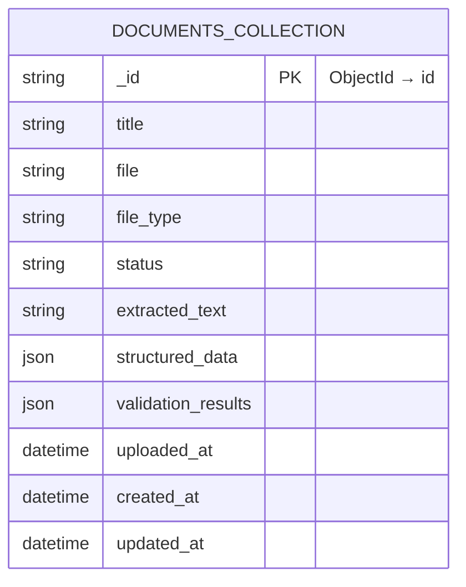
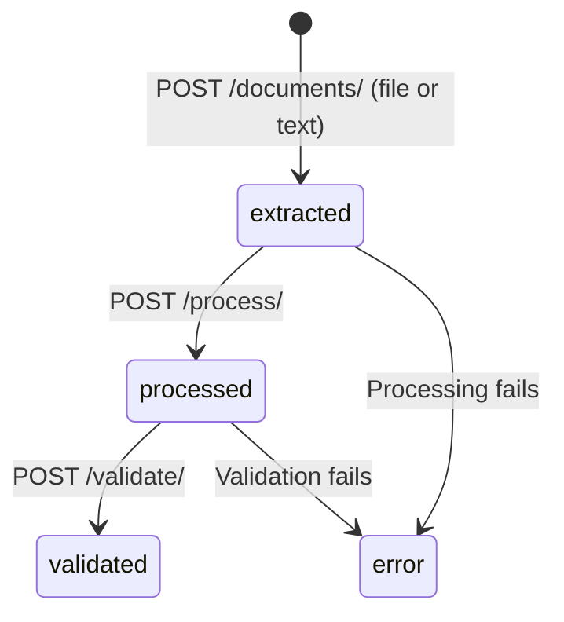
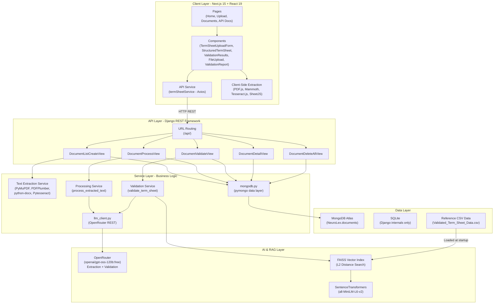
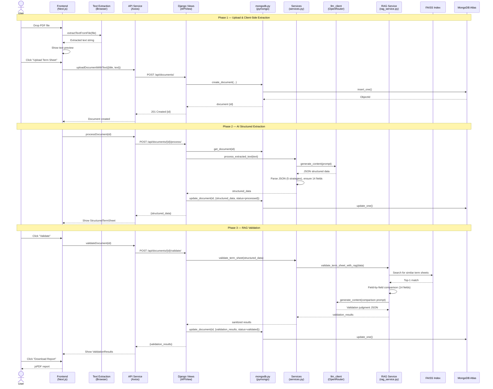
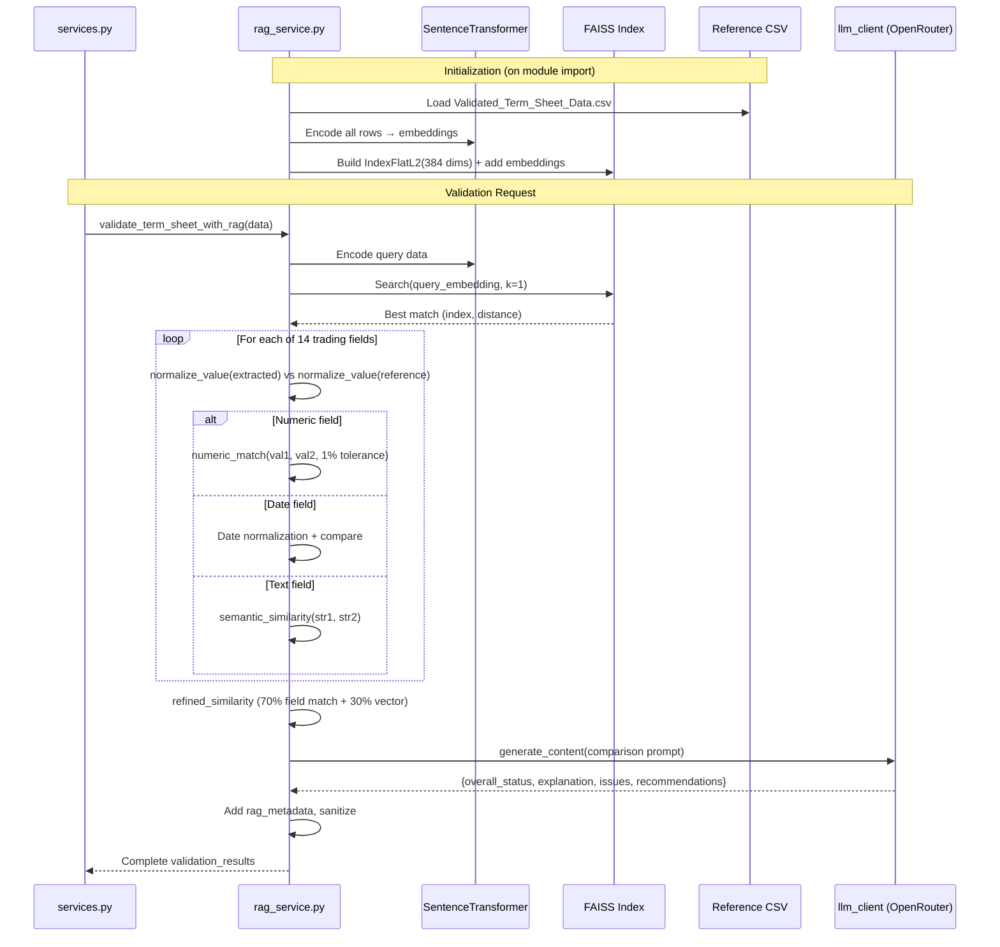

# NeuroLex: Term Sheet Analyzer — Technical Documentation

> **Version:** 2.0 · **Last Updated:** June 19, 2026
> A comprehensive "Zero-to-Hero" guide for new developers joining the project.

---

## Table of Contents

1. [Project Overview](#1-project-overview)
2. [Architecture Overview](#2-architecture-overview)
3. [Component-Level Breakdown](#3-component-level-breakdown)
4. [Functioning & Logic Flow](#4-functioning--logic-flow)
5. [API & Data Models](#5-api--data-models)
6. [Architecture Diagram (Mermaid.js)](#6-architecture-diagram-mermaidjs)
7. [Sequence Diagram (Mermaid.js)](#7-sequence-diagram-mermaidjs)
8. [Environment & Setup](#8-environment--setup)
9. [Error Handling Strategy](#9-error-handling-strategy)
10. [Key Design Decisions](#10-key-design-decisions)

---

## 1. Project Overview

### Purpose

**NeuroLex** is a full-stack AI-powered application that automates the analysis and validation of **financial trading term sheets**. It extracts structured data from unstructured documents (PDFs, DOCX, images, text) using a Large Language Model, then validates the extracted data against a reference database using Retrieval-Augmented Generation (RAG).

### Core Value Proposition

| Capability | Description |
|---|---|
| **Multi-format Ingestion** | Upload term sheets as PDF, DOCX, images (OCR), or plain text |
| **AI-Powered Extraction** | An OpenRouter-hosted LLM converts unstructured text → structured JSON with 14 trading fields |
| **RAG Validation** | FAISS vector store + SentenceTransformers find similar reference sheets; the LLM validates against them |
| **Client-Side Extraction** | PDF.js, Mammoth, Tesseract.js extract text in the browser for performance |
| **MongoDB Atlas Storage** | All document and validation data persists in a cloud MongoDB Atlas cluster |
| **PDF Reporting** | Generate downloadable validation reports as professional PDFs |

### Tech Stack

| Layer | Technology | Version |
|-------|-----------|---------|
| **Frontend Framework** | Next.js (App Router) | 15.2.4 |
| **UI Library** | React | 19.0 |
| **Language** | TypeScript | 5.x |
| **Styling** | TailwindCSS | 4.x |
| **HTTP Client** | Axios | 1.8.4 |
| **PDF Extraction (Client)** | pdfjs-dist | 3.11.174 |
| **DOCX Extraction (Client)** | Mammoth | 1.9.0 |
| **OCR (Client)** | Tesseract.js | 6.0.0 |
| **Excel Parsing** | xlsx (SheetJS) | 0.18.5 |
| **PDF Report Generation** | jsPDF + jspdf-autotable | 3.0.1 / 5.0.2 |
| **Icons** | react-icons (Feather) | 5.5.0 |
| **Backend Framework** | Django + DRF | 4.2.20 / 3.15.2 |
| **AI Provider** | OpenRouter (`openai/gpt-oss-120b:free`) | via REST (`requests`) |
| **Vector Search** | FAISS (CPU) | 1.10.0 |
| **Embeddings** | SentenceTransformers (`all-MiniLM-L6-v2`) | 3.4.1 |
| **PDF Extraction (Server)** | PyMuPDF + PDFPlumber + Pytesseract | Various |
| **DOCX Extraction (Server)** | python-docx | 1.1.2 |
| **Application Database** | MongoDB Atlas (via pymongo) | pymongo 3.12.3 |
| **Internal Database** | SQLite (Django auth/sessions/admin only) | Built-in |
| **CORS** | django-cors-headers | 4.6.0 |
| **Config** | python-dotenv | 1.0.1 |
| **Runtime** | Python 3.10 / Node.js ≥ 18 | — |

---

## 2. Architecture Overview

### Structural Pattern

NeuroLex follows a **Layered Client-Server Architecture** with clear separation of concerns. Application data lives in **MongoDB Atlas**, accessed through a dedicated pymongo service layer (not the Django ORM). Django's SQLite database is retained only for framework internals (auth, sessions, admin).

```
┌──────────────────────────────────────────────────────┐
│                   FRONTEND (Next.js)                 │
│  ┌──────────┐  ┌──────────┐  ┌────────────────────┐ │
│  │  Pages    │  │Components│  │  Services/Utils    │ │
│  │ (Routes)  │──│ (UI)     │──│ (API, Extraction)  │ │
│  └──────────┘  └──────────┘  └────────────────────┘ │
└──────────────────────┬───────────────────────────────┘
                       │ HTTP (REST API via Axios)
┌──────────────────────▼───────────────────────────────┐
│                BACKEND (Django + DRF)                │
│  ┌──────────┐  ┌──────────┐  ┌────────────────────┐ │
│  │  Views   │  │ Services │  │   RAG Service      │ │
│  │(APIView) │──│(Extract  │──│ (FAISS + LLM)      │ │
│  └────┬─────┘  │ + LLM)   │  └─────────┬──────────┘ │
│       │        └────┬─────┘            │            │
│  ┌────▼─────┐  ┌────▼─────┐      ┌──────▼─────────┐  │
│  │ mongodb  │  │llm_client│      │  CSV Reference │  │
│  │ (pymongo)│  │(OpenRouter)│    │  Data          │  │
│  └────┬─────┘  └────┬─────┘      └────────────────┘  │
└───────┼─────────────┼────────────────────────────────┘
        │             │
  ┌─────▼──────┐  ┌───▼─────────────────┐
  │  MongoDB   │  │  OpenRouter API     │
  │  Atlas     │  │ (gpt-oss-120b:free) │
  │ (NeuroLex) │  └─────────────────────┘
  └────────────┘
```

### Key Architectural Characteristics

- **Dual Text Extraction**: Text can be extracted client-side (browser) OR server-side. The frontend preferentially extracts text in the browser and sends the raw text to the backend, offloading heavy computation from the server.
- **Stateful Processing Pipeline**: Each document moves through states: `extracted` → `processed` → `validated` (with `error` on failure).
- **FAISS-backed RAG**: A vector store built from CSV reference data enables semantic search to find similar term sheets for validation comparison.
- **MongoDB-first persistence**: Documents, structured data, and validation results are stored as MongoDB documents in the `documents` collection of the `NeuroLex` database. A pymongo service module (`api/mongodb.py`) is the single source of truth for all data access.
- **Provider-agnostic LLM access**: All AI calls flow through a single `api/llm_client.py` module that talks to OpenRouter's chat completions endpoint. Swapping models or providers requires changing only this module and the environment config.
- **Single, unified API**: A focused set of `Document` endpoints (the legacy term-sheet/extracted-data/validation ViewSets have been removed).

---

## 3. Component-Level Breakdown

### 3.1 Backend (`backend/`)

#### 3.1.1 `termsheet_processor/` — Django Project Configuration

| File | Responsibility |
|------|---------------|
| `settings.py` | Django settings: loads `.env` via `python-dotenv`, SQLite for internals, MongoDB Atlas URI, CORS (allow all origins), DRF config, OpenRouter API config, logging, media paths |
| `urls.py` | Root URL configuration: mounts `api/` routes and Django admin at `admin/` |
| `wsgi.py` / `asgi.py` | WSGI/ASGI entry points for deployment |

#### 3.1.2 `api/` — Core Application Module

##### `mongodb.py` — Data Access Layer (MongoDB Atlas)

The single gateway to all application data. Uses a lazy singleton `MongoClient`.

| Function | Responsibility |
|----------|---------------|
| `get_db()` | Lazily connects to MongoDB Atlas (pings on first call), returns the `NeuroLex` database |
| `get_collection(name)` | Returns a collection handle |
| `create_document(data)` | Inserts a new document (`status='extracted'`), returns serialized result |
| `get_document(doc_id)` | Fetches one document by its `ObjectId` string |
| `list_documents()` | Returns all documents sorted by `created_at` descending |
| `update_document(doc_id, updates)` | Partial `$set` update, refreshes `updated_at` |
| `delete_document(doc_id)` | Deletes one document, returns boolean |
| `delete_all_documents()` | Deletes all documents, returns count |
| `_serialize(doc)` | Converts `ObjectId` → string and `datetime` → ISO string recursively |
| `normalise_doc(doc)` | Maps `_id` → `id` and ensures all expected fields are present for the frontend |

> **Design Note:** There is no Django ORM model for application data anymore. The previous `Document`, `TermSheetDocument`, `ExtractedTermSheet`, and `ValidationResult` ORM models are not used for storage — MongoDB documents in the `documents` collection hold everything (text, structured data, validation results) in a single record.

##### `llm_client.py` — LLM Provider Layer (OpenRouter)

| Function | Responsibility |
|----------|---------------|
| `generate_content(prompt, temperature=0.2, timeout=120)` | POSTs the prompt to OpenRouter's `/chat/completions` endpoint with the configured model, handles HTTP and API-level errors, and returns `choices[0].message.content` |

The request mirrors:

```bash
curl https://openrouter.ai/api/v1/chat/completions \
  -H "Authorization: Bearer $OPENROUTER_API_KEY" \
  -H "Content-Type: application/json" \
  -d '{"model": "openai/gpt-oss-120b:free", "messages": [{"role": "user", "content": "..."}]}'
```

##### `views.py` — API Endpoints (Class-Based `APIView`s)

| View | URL | Methods | Description |
|------|-----|---------|-------------|
| `DocumentListCreateView` | `/api/documents/` | `GET`, `POST`, `DELETE` | List all docs, create a doc (file or pre-extracted text), delete all docs |
| `DocumentDeleteAllView` | `/api/documents/delete_all/` | `DELETE` | Explicit delete-all endpoint used by the frontend |
| `DocumentDetailView` | `/api/documents/<id>/` | `GET`, `DELETE` | Get or delete a single document |
| `DocumentProcessView` | `/api/documents/<id>/process/` | `POST` | Extract structured data via the LLM |
| `DocumentValidateView` | `/api/documents/<id>/validate/` | `POST` | Validate the term sheet via RAG + LLM |

Helper: `make_json_safe(obj)` recursively sanitises NaN/Infinity and non-serialisable values before responses and storage.

##### `services.py` — Business Logic Layer

| Function | Responsibility |
|----------|---------------|
| `extract_text_from_file(uploaded_file)` | Routes to appropriate extractor based on file extension |
| `extract_text_from_pdf(pdf_file)` | Multi-strategy PDF extraction: PyMuPDF → PDFPlumber → OCR fallback |
| `extract_pdf_with_ocr(pdf_file)` | Converts PDF pages to images, applies Pytesseract OCR |
| `extract_text_from_docx(docx_file)` | Extracts text from paragraphs and tables using python-docx |
| `process_extracted_text(text)` | **Core AI function**: builds a structured prompt, calls `llm_client.generate_content()`, parses the JSON response with 5 fallback strategies, extracts 14 trading fields |
| `validate_term_sheet(structured_data)` | Delegates to RAG service, sanitises NaN/Infinity, ensures JSON serialization |

##### `rag_service.py` — RAG Validation Engine

| Function | Responsibility |
|----------|---------------|
| `initialize_vector_store()` | Loads `Validated_Term_Sheet_Data.csv`, creates embeddings with `all-MiniLM-L6-v2`, builds FAISS L2 index. Runs on module import. |
| `search_similar_term_sheets(structured_data, top_k)` | Encodes query as vector, searches FAISS index, returns top-k matches with similarity scores |
| `validate_term_sheet_with_rag(structured_data)` | **Core validation**: finds best match → does field-by-field smart comparison (14 fields, numeric tolerance, semantic similarity, date normalization) → sends comparison to the LLM (via `llm_client.generate_content()`) for final judgment |
| `normalize_value(value)` | Handles date formats, option type synonyms (Call/Put), position types (Buy/Sell), currency formatting |
| `numeric_match(val1, val2, tolerance)` | Compares numbers with 1% tolerance |
| `semantic_similarity(str1, str2)` | Trading-specific synonym matching (NYSE ↔ "New York Stock Exchange", USD ↔ "Dollar", etc.) |
| `make_json_serializable(obj)` | Recursively converts non-serialisable objects to strings |

##### `urls.py` — API Routing

Plain `path()` routing (no DRF router). All routes are prefixed with `/api/` via the project `urls.py`.

#### 3.1.3 `data/` — Reference Data

Contains CSV files used by the RAG service for term sheet validation:

| File | Purpose |
|------|---------|
| `Validated_Term_Sheet_Data.csv` | **Primary reference** loaded by `rag_service.py` for FAISS indexing |
| `termsheet_validation_final.csv` | Large validation dataset |
| `termsheet_validation_large.csv` | Additional reference data |
| `term_sheet_reference.csv` | Supplementary reference data |

---

### 3.2 Frontend (`frontend/`)

#### 3.2.1 `src/app/` — Next.js App Router Pages

| Route | File | Description |
|-------|------|-------------|
| `/` | `page.tsx` | Landing page with hero section, feature cards, processing flow steps, and CTA |
| `/upload` | `upload/page.tsx` | Term sheet upload page — renders `TermSheetUploadForm` |
| `/documents` | `documents/page.tsx` | Document list — fetches all documents, shows status badges, delete actions |
| `/documents/[id]` | `documents/[id]/page.tsx` | Document detail — displays structured data, triggers process/validate, shows results |
| `/api-docs` | `api-docs/page.tsx` | Interactive API documentation page |

#### 3.2.2 `src/components/` — React Components

| Component | File | Responsibility |
|-----------|------|---------------|
| `TermSheetUploadForm` | `TermSheetUploadForm.tsx` | Main upload form: drag-and-drop file selection, client-side text extraction, text preview, upload submission, auto-processing pipeline |
| `FileUpload` | `FileUpload.tsx` | Reusable file upload widget with drag-and-drop, file type validation, size limits |
| `StructuredTermSheet` | `StructuredTermSheet.tsx` | Displays extracted structured data in categorized sections. Supports JSON and CSV download |
| `ValidationResults` | `ValidationResults.tsx` | Renders validation results: status badge, explanation, issues table (sorted by severity), RAG metadata with field-by-field comparison, recommendations |
| `ValidationReport` | `ValidationReport.tsx` | Generates professional PDF validation reports using jsPDF with auto-tables |
| `TermSheetAnalyzer` | `TermSheetAnalyzer.tsx` | Self-contained analyzer: uploads, extracts text client-side, processes, and validates a term sheet |
| `Header` | `Header.tsx` | Application header with branding |

##### Layout & UI Components

| Component | File | Description |
|-----------|------|-------------|
| `Layout` | `layout/Layout.tsx` | Page layout wrapper with consistent spacing and structure |
| `Navbar` | `layout/Navbar.tsx` | Navigation bar with links to Home, Upload, Documents, API Docs |
| `Button` | `ui/Button.tsx` | Reusable button component with variants and sizes |

#### 3.2.3 `src/services/` — API Communication

| File | Description |
|------|-------------|
| `api.ts` | `termSheetService` object with methods: `getDocuments`, `getDocument`, `uploadDocument`, `uploadDocumentWithText`, `processDocument`, `validateDocument`, `getExtractedData`, `getValidationResult`, `deleteAllDocuments` (calls `documents/delete_all/`), `deleteDocument`. Uses Axios with structured error handling. |

#### 3.2.4 `src/types/` — TypeScript Definitions

| Interface | Key Fields |
|-----------|-----------|
| `TermSheetDocument` | `id`, `title`, `file`, `status`, `extracted_text`, `structured_data`, `validation_results` |
| `TermSheetData` | 14 trading fields: `trade_id`, `trade_date`, `reference_spot_price`, `notional_amount`, `strike_price`, `option_type`, `position_type`, `expiry_date`, `business_calendar`, `delivery_date`, `premium_rate`, `transaction_currency`, `counter_currency`, `underlying_currency` |
| `ValidationResult` | `status`, `explanation`, `issues[]`, `recommendations`, `validation_details`, `rag_metadata` |
| `ValidationIssue` | `field`, `severity` (high/medium/low), `description` |
| `RagMetadata` | `reference_sheet_id`, `similarity_score`, `comparison_summary[]` |
| `ApiResponse<T>` | `data?: T`, `error?: string`, `warning?: string` |

#### 3.2.5 `src/utils/` — Utility Functions

| File | Functions | Description |
|------|----------|-------------|
| `textExtraction.ts` | `extractTextFromPDF`, `extractTextFromDOCX`, `extractTextFromTXT`, `extractTextFromImage`, `extractTextFromExcel`, `extractTextFromFile` | Client-side text extraction for each supported format |
| `logger.ts` | `logger.info`, `logger.warn`, `logger.error` | Structured logging utility |

#### 3.2.6 `src/config/`

| File | Description |
|------|-------------|
| `api.ts` | `API_ENDPOINTS` constants object with URL builder functions for all API routes |

#### 3.2.7 Build Configuration

- `next.config.js` — Sets webpack `resolve.fallback` polyfills (`fs`, `path`, `crypto`, `os`, `stream`, `zlib` → `false`) so client-side extraction libraries (tesseract.js, pdfjs-dist) work in the browser. (The previously duplicate `next.config.ts` has been removed.)
- `eslint.config.mjs` — Extends `next/core-web-vitals` + `next/typescript`, with `no-explicit-any` disabled and `no-unused-vars` / `exhaustive-deps` set to warnings to keep production builds clean.

---

## 4. Functioning & Logic Flow

### 4.1 Life of a Request: Complete Document Processing Pipeline

#### Phase 1: Document Upload & Text Extraction

```
User drops PDF file → TermSheetUploadForm.onDrop()
    │
    ▼
File validation (type, size ≤ 10MB)
    │
    ▼
Client-side text extraction:
    extractTextFromFile(file) → extractTextFromPDF(file)
        → PDF.js loads ArrayBuffer
        → Iterates pages, extracts text content
        → Returns concatenated text
    │
    ▼
Text preview shown to user (textarea, editable)
    │
    ▼
User clicks "Upload Term Sheet"
    │
    ▼
termSheetService.uploadDocumentWithText({title, file_type, extracted_text})
    │
    ▼
POST /api/documents/
    → DocumentListCreateView.post()
    → mongodb.create_document(...)
    → MongoDB document saved with status='extracted'
    → Returns document id (ObjectId string)
```

#### Phase 2: AI-Powered Structured Data Extraction

```
termSheetService.processDocument(documentId)
    │
    ▼
POST /api/documents/{id}/process/
    → DocumentProcessView.post()
    → mongodb.get_document(id); checks text ≥ 20 chars, not already processed
    │
    ▼
process_extracted_text(text)
    → Constructs detailed prompt for the LLM
    → llm_client.generate_content(prompt) → OpenRouter (openai/gpt-oss-120b:free)
    │
    ▼
Response parsing (5 strategies):
    1. Direct JSON.parse
    2. Remove markdown code blocks → parse
    3. Fix Python-isms (True→true, None→null) → parse
    4. Find first '{' and last '}' → extract → parse
    5. Regex field-by-field extraction as last resort
    │
    ▼
Post-processing:
    → Clean numeric values
    → Ensure all 14 fields present (default: "Not specified")
    → Extra Trade ID extraction from original text
    → mongodb.update_document(id, {structured_data, status='processed', title=trade_id})
    │
    ▼
Returns structured_data JSON to frontend
    → StructuredTermSheet component renders data
```

#### Phase 3: RAG-Powered Validation

```
termSheetService.validateDocument(documentId)
    │
    ▼
POST /api/documents/{id}/validate/
    → DocumentValidateView.post()
    → mongodb.get_document(id); checks structured_data exists
    │
    ▼
validate_term_sheet(structured_data) → validate_term_sheet_with_rag(structured_data)
    │
    ▼
Step 1: Vector Search
    → Encode structured_data with SentenceTransformer ('all-MiniLM-L6-v2')
    → Search FAISS index → top-1 result
    │
    ▼
Step 2: Smart Field-by-Field Comparison (14 fields)
    ├─ trade_id: case-insensitive exact match
    ├─ option_type / position_type: synonym matching
    ├─ notional_amount: numeric + optional currency
    ├─ reference_spot_price / strike_price: numeric with 1% tolerance
    ├─ premium_rate: percentage comparison
    ├─ dates: date normalization
    └─ others: semantic similarity + substring matching
    │
    ▼
Step 3: AI Validation Judgment
    → Build comparison prompt → llm_client.generate_content() → OpenRouter
    → Parse JSON: {overall_status, explanation, issues[], recommendations}
    │
    ▼
Step 4: Result Enrichment & Sanitization
    → Add rag_metadata (reference_id, similarity_score, comparison_summary)
    → Sanitize NaN/Infinity, ensure JSON serializable
    → mongodb.update_document(id, {validation_results, status='validated'})
    │
    ▼
Returns validation_results to frontend
    → ValidationResults component renders status, issues, RAG comparison
    → User can download PDF report
```

---

## 5. API & Data Models

### 5.1 REST API Endpoints

Base URL: `http://localhost:8000/api/`

#### Documents API

| Method | Endpoint | Description | Request Body | Response |
|--------|----------|-------------|-------------|----------|
| `GET` | `/documents/` | List all documents | — | `TermSheetDocument[]` |
| `POST` | `/documents/` | Create document | `{file}` or `{title, extracted_text, file_type}` | `TermSheetDocument` |
| `DELETE` | `/documents/` | Delete ALL documents | — | `{message}` |
| `DELETE` | `/documents/delete_all/` | Delete ALL documents (explicit) | — | `{message}` |
| `GET` | `/documents/{id}/` | Get document by ID | — | `TermSheetDocument` |
| `DELETE` | `/documents/{id}/` | Delete document | — | `204 No Content` |
| `POST` | `/documents/{id}/process/` | Extract structured data | — | `{structured_data}` |
| `POST` | `/documents/{id}/validate/` | Validate term sheet | — | `{document_id, validation_results}` |

> **Note:** Document IDs are MongoDB `ObjectId` strings (e.g. `6a3539c49c4fa0e7d8cf7f86`), not integers.

### 5.2 Data Model (MongoDB `documents` collection)

A single collection holds the entire lifecycle of a document. There are no foreign keys — each record is self-contained.

```json
{
  "_id": "ObjectId (string in API responses, mapped to `id`)",
  "title": "FX20240620",
  "file": null,
  "file_type": "txt",
  "status": "extracted | processed | validated | error",
  "extracted_text": "raw document text...",
  "structured_data": { "...14 trading fields..." },
  "validation_results": { "overall_status": "...", "explanation": "...", "issues": [], "recommendations": "..." },
  "uploaded_at": "ISO-8601 datetime",
  "created_at": "ISO-8601 datetime",
  "updated_at": "ISO-8601 datetime"
}
```



> Django's SQLite database still exists (`db.sqlite3`) but only stores framework tables: `auth_*`, `django_session`, `django_admin_log`, `django_content_type`, `django_migrations`.

### 5.3 Structured Data Schema (14 Trading Fields)

```json
{
  "trade_id": "FX-OPT-20250315-001",
  "trade_date": "2025-03-15",
  "reference_spot_price": "1.2000",
  "notional_amount": "471988 USD",
  "strike_price": "1.2500",
  "option_type": "Call",
  "position_type": "Buying",
  "expiry_date": "2025-06-15",
  "business_calendar": "NYSE",
  "delivery_date": "2025-06-17",
  "premium_rate": "2.5%",
  "transaction_currency": "USD",
  "counter_currency": "EUR",
  "underlying_currency": "EUR/USD"
}
```

### 5.4 Validation Result Schema

```json
{
  "overall_status": "valid | invalid | uncertain",
  "explanation": "Detailed assessment of the term sheet...",
  "issues": [
    {
      "field": "strike_price",
      "description": "Strike price differs by 3.2% from reference",
      "severity": "high",
      "correction": "Verify strike price should be 1.2500"
    }
  ],
  "recommendations": "Review pricing fields carefully...",
  "rag_metadata": {
    "reference_sheet_id": "ref_0",
    "similarity_score": 0.85,
    "match_rate": "12/14",
    "match_percentage": 0.857,
    "comparison_summary": [
      {
        "field": "trade_id",
        "extracted_value": "FX-OPT-001",
        "reference_value": "FX-OPT-001",
        "is_matched": true,
        "match_method": "trade_id exact match",
        "is_critical": true
      }
    ]
  }
}
```

### 5.5 Document Status State Machine



---

## 6. Architecture Diagram (Mermaid.js)



---

## 7. Sequence Diagram (Mermaid.js)

### 7.1 Complete Upload → Process → Validate Flow



### 7.2 RAG Validation Internal Flow



---

## 8. Environment & Setup

### Prerequisites

- **Node.js** ≥ 18.x and npm
- **Python** 3.10 (Django 4.2 requires ≥ 3.10; the project was set up with `python3.10`)
- **OpenRouter API Key** (from [openrouter.ai](https://openrouter.ai/keys))
- **MongoDB Atlas** connection string (a cluster + database named `NeuroLex`)
- Tesseract OCR (optional, for server-side image OCR)
- Poppler (optional, for `pdf2image` PDF-to-image conversion)

### Backend Setup

```bash
cd backend
python3.10 -m pip install -r requirements.txt
python3.10 manage.py migrate          # sets up SQLite internals only
python3.10 manage.py runserver        # http://localhost:8000
```

Convenience script: `./start_backend.sh` (from the repo root).

### Frontend Setup

```bash
cd frontend
npm install
npm run dev          # http://localhost:3000 (Turbopack)
npm run build        # production build (verified clean)
```

Convenience script: `./start_frontend.sh` (from the repo root).

### Environment Variables (`backend/.env`)

The backend loads `.env` automatically via `python-dotenv`. This file is gitignored — never commit secrets.

| Variable | Description |
|----------|-------------|
| `OPENROUTER_API_KEY` | OpenRouter API key (Bearer token) |
| `OPENROUTER_MODEL` | Model id, default `openai/gpt-oss-120b:free` |
| `MONGO_URI` | MongoDB Atlas connection string (SRV format) |
| `DJANGO_SECRET_KEY` | Django secret key |
| `DEBUG` | `True` / `False` |

Frontend:

| Variable | Default | Description |
|----------|---------|-------------|
| `NEXT_PUBLIC_API_URL` | `http://localhost:8000/api` | Backend API URL |

Relevant `settings.py` keys derived from the env: `OPENROUTER_API_KEY`, `OPENROUTER_MODEL`, `OPENROUTER_BASE_URL` (`https://openrouter.ai/api/v1/chat/completions`), `MONGO_URI`, `MONGO_DB_NAME` (`NeuroLex`).

---

## 9. Error Handling Strategy

### Backend

- **Multi-Layer Try/Catch**: Every service function, view, and extraction method has comprehensive exception handling.
- **Graceful Degradation**: Processing failures return partial structured data with an `error`/`warning` field rather than crashing.
- **5-Strategy JSON Parsing**: `process_extracted_text` tries five different strategies to parse the LLM's response before falling back to regex extraction.
- **LLM error surfacing**: `llm_client.generate_content()` raises a clear `RuntimeError` for HTTP failures, non-JSON responses, API-level errors (including 429 rate limits on the free tier), and unexpected response shapes.
- **NaN/Infinity Sanitization**: `make_json_safe()` and `make_json_serializable()` prevent serialization errors from reaching the client or MongoDB.
- **MongoDB connection safety**: The pymongo client uses a 10s server-selection timeout and pings on first connection; failures are logged and raised cleanly.

### Frontend

- **Typed API Responses**: `ApiResponse<T>` wrapper provides consistent `data`/`error`/`warning` handling.
- **Partial Data Support**: For 422/500 errors with structured data available, the UI displays what was extracted.
- **Client-Side Extraction Fallback**: If client-side extraction fails, the user can paste text manually.
- **Structured Logging**: Custom `logger` utility provides consistent logging across the app.

---

## 10. Key Design Decisions

| Decision | Rationale |
|----------|-----------|
| **MongoDB Atlas for app data** | Flexible schema for evolving document/validation shapes; cloud-hosted, no local DB ops; a single self-contained record per document simplifies reads |
| **SQLite kept for Django internals** | Django's auth/sessions/admin still need a relational store; `djongo` is incompatible with Django 4.2+, so MongoDB is accessed directly via pymongo instead |
| **Dedicated `mongodb.py` data layer** | One place for all data access; isolates pymongo specifics (ObjectId/datetime serialization) from views |
| **OpenRouter via a single `llm_client`** | Provider-agnostic LLM access; switching models/providers touches one module and the env config |
| **Client-side text extraction** | Offloads CPU-intensive work (PDF parsing, OCR) from the server; reduces bandwidth by sending text instead of files |
| **FAISS over managed vector DB** | Lightweight, in-process, no external dependency; ideal for small reference datasets |
| **SentenceTransformers `all-MiniLM-L6-v2`** | Good semantic similarity at only 384 dimensions — fast to encode and search |
| **5-strategy JSON parsing** | LLM output varies (markdown blocks, Python-style booleans, etc.); multiple strategies ensure robust parsing |
| **Same LLM for extraction AND validation** | Single provider simplifies infra; extraction uses structured prompts, validation uses comparison-based prompts |
| **Single unified Documents API** | The legacy term-sheet/extracted-data/validation ViewSets were removed to reduce maintenance surface |
| **CORS allow all origins** | Development convenience; must be restricted in production |

---

*This documentation reflects the NeuroLex codebase after migration to MongoDB Atlas and OpenRouter. For questions, contact the development team.*
